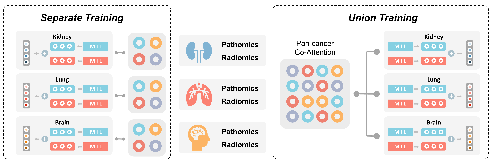
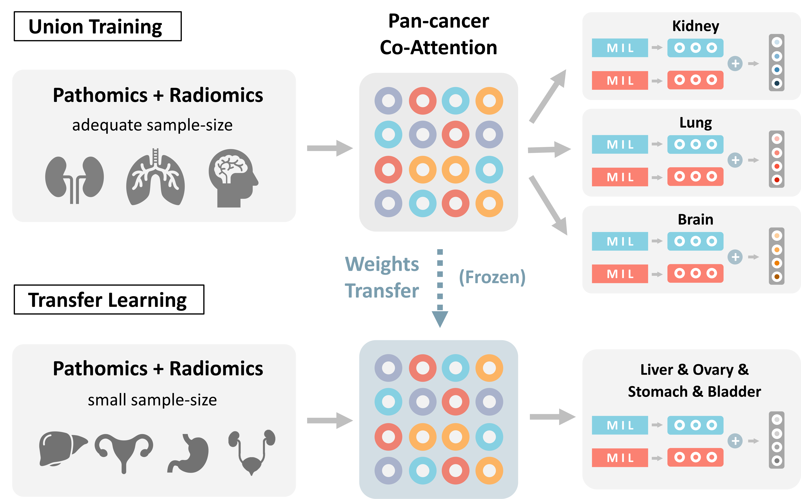

# Leveraging Co-Attention-Based Interactions Between Pathomics and Radiomics for Pan-Cancer Survival Prediction

This is the Github Repository for "Leveraging Co-Attention-Based Interactions Between Pathomics and Radiomics for Pan-Cancer Survival Prediction".

## Installation

First clone the repo and cd into the directory:

```
git clone https://github.com/EstelleXIA/coattention-pathomics-radiomics.git
cd coattention-pathomics-radiomics
```

Then use the environment configuration file located in `./environment.yaml` to create a conda environment:

```
conda env create -n para-mil -f environment.yaml
```

Finally activate the `para-mil` environment:

```
conda activate para-mil
```

## Instructions

### I. Data Preparation

The dataset used in this study includes both in-house and public resources. The data collection for each cancer type can be divided into two parts: one for the development of the CS-GCN model to extract cell-cell interactions in pathomics, and the other for the development of the PaRa-MIL model for survival prediction. There are no sample overlaps between these two parts of the data.

The sample sizes are listed below.

| Cancer Type | \# CS-GCN Patients | \# CS-GCN WSIs | \# PaRa-MIL Patients | \# PaRa-MIL WSIs | \# PaRa-MIL CT/MRI |
| :---------: | :----------------: | :------------: | :------------------: | :--------------: | :----------------: |
|   Kidney    |        503         |      508       |         777          |      2,345       |        777         |
|    Lung     |        772         |      860       |         278          |       492        |        278         |
|    Brain    |        646         |     1,213      |         165          |       335        |        165         |
|    Ovary    |        123         |      221       |          61          |        61        |         61         |
|    Liver    |        202         |      209       |          44          |        47        |         44         |
|   Stomach   |        234         |      256       |          39          |        39        |         39         |
|   Bladder   |        252         |      281       |          72          |        98        |         72         |
|  **Total**  |     **2,732**      |   **3,548**    |      **1,436**       |    **3,417**     |     **1,436**      |

You can access the original public dataset through the links provided in the following table.

| Cancer Type | CS-GCN Development                                           | PaRa-MIL Development                                         |                                                              |
| ------------------- | -------------------------------------------------- | ------------------------------------------------------------ | ------------------------------------------------------------ |
| Data              | Pathology Only                                               | Pathology                                                    | Radiology                                                    |
| Kidney (KIRC) | /                                                            | /                                                            | /                                                            |
| Lung (LUNG)       | https://portal.gdc.cancer.gov/projects/TCGA-LUAD <br/>https://portal.gdc.cancer.gov/projects/TCGA-LUSC | https://portal.gdc.cancer.gov/projects/TCGA-LUAD<br/>https://portal.gdc.cancer.gov/projects/TCGA-LUSC<br/>https://www.cancerimagingarchive.net/collection/nlst/ | https://www.cancerimagingarchive.net/collection/nlst/        |
| Brain (BRAT)      | https://portal.gdc.cancer.gov/projects/TCGA-GBM <br/>https://portal.gdc.cancer.gov/projects/TCGA-LGG | https://portal.gdc.cancer.gov/projects/TCGA-GBM<br/>https://portal.gdc.cancer.gov/projects/TCGA-LGG | https://www.cancerimagingarchive.net/collection/tcga-gbm/<br/>https://www.cancerimagingarchive.net/collection/tcga-lgg/ |
| Liver (LIHC)      | https://portal.gdc.cancer.gov/projects/TCGA-LIHC             | https://portal.gdc.cancer.gov/projects/TCGA-LIHC             | https://www.cancerimagingarchive.net/collection/tcga-lihc/   |
| Ovary (HSOC)      | https://www.cancerimagingarchive.net/collection/ovarian-bevacizumab-response/ | https://www.synapse.org/Synapse:syn25946117/wiki/611576      | https://www.synapse.org/Synapse:syn25946117/wiki/611576      |
| Stomach (STAD)    | https://portal.gdc.cancer.gov/projects/TCGA-STAD             | https://portal.gdc.cancer.gov/projects/TCGA-STAD             | https://www.cancerimagingarchive.net/collection/tcga-stad/   |
| Bladder (BLCA)    | https://portal.gdc.cancer.gov/projects/TCGA-BLCA             | https://portal.gdc.cancer.gov/projects/TCGA-BLCA             | https://www.cancerimagingarchive.net/collection/tcga-blca/   |

We have performed data cleaning and labelling for these data. The processed data can be accessed at.


### II. Pathomics & Radiomics Extraction

The following part uses the bladder tumor (BLCA) as a demo. You need to download the data and put into the `data/` . Here is an example of directory for pathological and radiological data.

```
data
├── BLCA
│   ├── TCGA-BLCA  # the directory for pathological data
│   │   └── pathology_svs
│   │   │   ├── TCGA-4Z-AA7N-01Z-00-DX1.svs
│   │   │   ├── TCGA-4Z-AA7O-01Z-00-DX1.svs
│   │   │   ├── TCGA-4Z-AA7W-01Z-00-DX1.svs
│   │   │   └── ...
│   └── TCIA-BLCA  # the directory for radiological data
│   │   ├── img_nii
│   │   │   ├── TCGA-4Z-AA7N_0000.nii.gz
│   │   │   ├── TCGA-4Z-AA7O_0000.nii.gz
│   │   │   ├── TCGA-4Z-AA7W_0000.nii.gz
│   │   │   └── ...
│   │   └── mask_nii
│   │   │   ├── TCGA-4Z-AA7N.nii.gz
│   │   │   ├── TCGA-4Z-AA7O.nii.gz
│   │   │   ├── TCGA-4Z-AA7W.nii.gz
│   │   │   └── ...
└── ...
```

#### Pathomics Generation


##### 1. Cut WSI into patches

In this step, you can use any method to cut WSI into patches with size of 768x768 at 40x magnification or 0.25 microns per pixel (mpp). Here we give a reference example.

First, create a codebook to organize the number of pathological slides for each patient.

```
python ./pathomics_extraction/preparation/1_prepare_wsi_codebook.py --task BLCA
```

This step will create `svs_blca.csv` under `data/BLCA/TCGA-BLCA/`.

Then, we cut patches and applied luminosity and color normalization.

```
python ./pathomics_extraction/preparation/2_cut_patches.py --task BLCA
```

This step could be time-consuming. We recommend using the Array Jobs with Slurm to fasten this process. We provide an example in `./pathomics_extraction/preparation/2_cut_patches.slurm`.

##### 2. Nuclei segmentation and classification

You can use the official Github repository of [Hover-Net](https://github.com/vqdang/hover_net) for nuclei segmentation and classification. Or you can refer to [Hover-UNet](https://github.com/DIAGNijmegen/HoVer-UNet), which modified HoVerNet to accelerate the inference process.

Ensure that a pickle file is generated for each patch, comprising the nuclei masks and the corresponding cell types. The pickle files should be formatted as follows:

```
data
├── BLCA
│   ├── TCGA-BLCA
│   │   └── pickle
│   │   │   ├── TCGA-4Z-AA7N
│   │   │   │   ├── TCGA-4Z-AA7N_0_2304-18432.pickle
│   │   │   │   ├── TCGA-4Z-AA7N_0_2304-19200.pickle
│   │   │   │   ├── TCGA-4Z-AA7N_0_2304-20736.pickle
│   │   │   │   └── ...
│   │   │   ├── TCGA-4Z-AA7O
│   │   │   │   ├── TCGA-4Z-AA7O_0_0-109056.pickle
│   │   │   │   ├── TCGA-4Z-AA7O_0_0-109824.pickle
│   │   │   │   ├── TCGA-4Z-AA7O_0_0-110592.pickle
│   │   │   │   └── ...
│   │   │   └── ...
└── ...
```

##### 3. Histomics feature extraction 

```
python ./pathomics_extraction/omics/nuclei_graph_construction/1_nuclei_feature_extraction.py --task BLCA
```

You can also use the Array Jobs with Slurm to accerlate this process. We provide an example in `./pathomics_extraction/omics/nuclei_graph_construction/1_nuclei_feature_extraction.slurm`.

##### 4. Patch nuclei graph construction

```
python ./pathomics_extraction/omics/nuclei_graph_construction/2_patch_nuclei_graph_construction.py --task BLCA
```

You can also use the Array Jobs with Slurm to accerlate this process. We provide an example in `./pathomics_extraction/omics/nuclei_graph_construction/2_patch_nuclei_graph_construction.slurm`.

##### 5. Intercellular feature extraction

We provide trained checkpoints in `./pathomics_extraction/omics/patch_feature_extraction/ckpts` for intercellular feature extraction.

```
python ./pathomics_extraction/omics/patch_feature_extraction/inference.py --task BLCA
```

If you want to train the model on your own, you can run the following command.

```
python ./pathomics_extraction/omics/patch_feature_extraction/train.py --task BLCA --fold 0 
```

##### 6. Morphological feature extraction

First create `.json` files to record the patch index.

```
python ./pathomics_extraction/morphological/1_prepare_patch_json.py --task BLCA
```

Then extract morphological patch features.

```
python ./pathomics_extraction/morphological/2_extract_resnet_feature.py --task BLCA
```

##### 7. Generate combined pathomics features

Combine intercellular characteristics with morphological features to formulate the pathomics of a patch.

```
python ./pathomics_extraction/combined/combine_features.py --task BLCA
```

#### Radiomics Generation


##### 1. Pyradiomics features extraction

Five levels of features (shape, first-orde, texture, log-sigma, and wavelet) were extracted from Pyradiomics for each radiological scan.

```
python ./radiomics_extraction/omics/1_extract_pyradiomics.py --task BLCA
```

Then being combined into a single file.

```
python ./radiomics_extraction/omics/2_combine_all_radiomics.py --task BLCA
```

##### 2. Morphological feature extraction

For morphological characteristics, we use the [Rad-FM](https://github.com/chaoyi-wu/RadFM.git) foundation model.

```
cd ./radiomics_extraction/morphological/
git clone https://github.com/chaoyi-wu/RadFM.git
```

Download the checkpoints [here](https://pan.baidu.com/s/1A-K5nXCbvWAVqvb6dLjYJg?pwd=q1eo) and put the file `pytorch_model.bin` under the directory `./radiomics_extraction/morphological/`.

Crop the region(s) of interest.

```
python ./radiomics_extraction/morphological/1_prepare_roi.py --task BLCA
```

Then extract the morphological features.

```
python ./radiomics_extraction/morphological/2_extract_feature.py --task BLCA
```


### III. PaRa-MIL and Comparative Methods for Survival Prediction


#### PaRa-MIL

A multimodal model for survival prediction capturing the interactions between pathomics and radiomics through a coattention Transformer.

```
python ./survival_modeling/train.py --task [KIRC,LUNG,BRAT] --fold [0,1,2,3,4] --model PaRa_MIL
```

#### PaRa-MIL-wo

The same architecture as PaRa-MIL except for the cell-cell interaction features in pathomics.

```
python ./survival_modeling/train.py --task [KIRC,LUNG,BRAT] --fold [0,1,2,3,4] --model PaRa_MIL_wo
```

#### Rad-MIL

A single-modal model that uses radiomics features as input. The structure is identical to the radiological imaging branch of PaRa-MIL.

```
python ./survival_modeling/train.py --task [KIRC,LUNG,BRAT] --fold [0,1,2,3,4] --model Rad_MIL
```

#### Path-MIL

A single-modal method that uses pathological features as input. The structure is identical to the pathological imaging branch of PaRa-MIL.

```
python ./survival_modeling/train.py --task [KIRC,LUNG,BRAT] --fold [0,1,2,3,4] --model Path_MIL
```

For lung and brain tumors, we provided pretrained weights [here](https://zenodo.org/records/13938584) for reproducibility.

We also provided a running demo in `./demo/PaRa-MIL_demo.ipynb`.

### IV. Union Training



```
python ./union_training/train.py --fold [0,1,2,3,4]
```

We provided pretrained weights [here](https://zenodo.org/records/13938584) for reproducibility, and present a demo for inference in `./demo/union_training_demo.ipynb` .

### V. Transfer Learning



#### Train-from-scratch

The code for train-from-scratch approach is the same as PaRa-MIL, where we present a running demo in `./demo/PaRa-MIL_demo.ipynb`.

#### Using the coattention weights learned from union training

First, generate ensembled coattention-guided pathomics and radiomics using the  five-fold checkpoints during the union training.

The inference process of each fold:

```
python ./transfer_learning/preparation_omics/1_generate_pathomics_radiomics.py --task ["LIHC", "HSOC", "STAD", "BLCA"]
```

The ensemble process:

```
python ./transfer_learning/preparation_omics/2_ensemble_pathomics_radiomics.py --task ["LIHC", "HSOC", "STAD", "BLCA"]
```

Then, train the PaRa-MIL structure with coattention weights frozened.

```
python ./transfer_learning/train.py --task ["LIHC", "HSOC", "STAD", "BLCA"]
```

We provided pretrained weights [here](https://zenodo.org/records/13938584) for reproducibility, and present a demo for inference in `./demo/transfer_learning_demo.ipynb` .

## References

This repository include some code taken from https://github.com/sdw95927/Ceograph and https://github.com/mahmoodlab/MCAT.

## License and Usage

This model and associated code are released under the CC-BY-NC-ND 4.0 License and is available for non-commercial academic purposes.

If you have any question, please contact this [Email](mailto:Estelle-xyj@sjtu.edu.cn).

